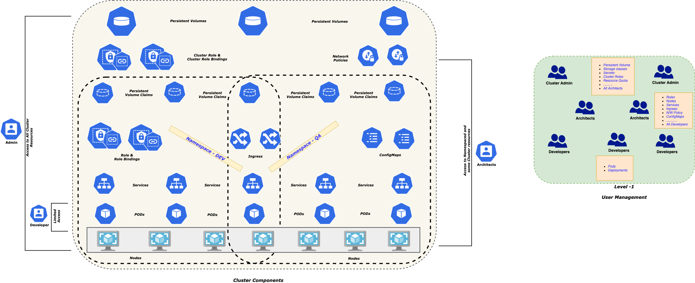
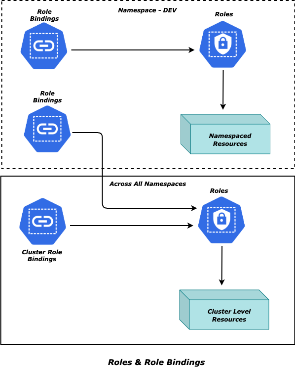
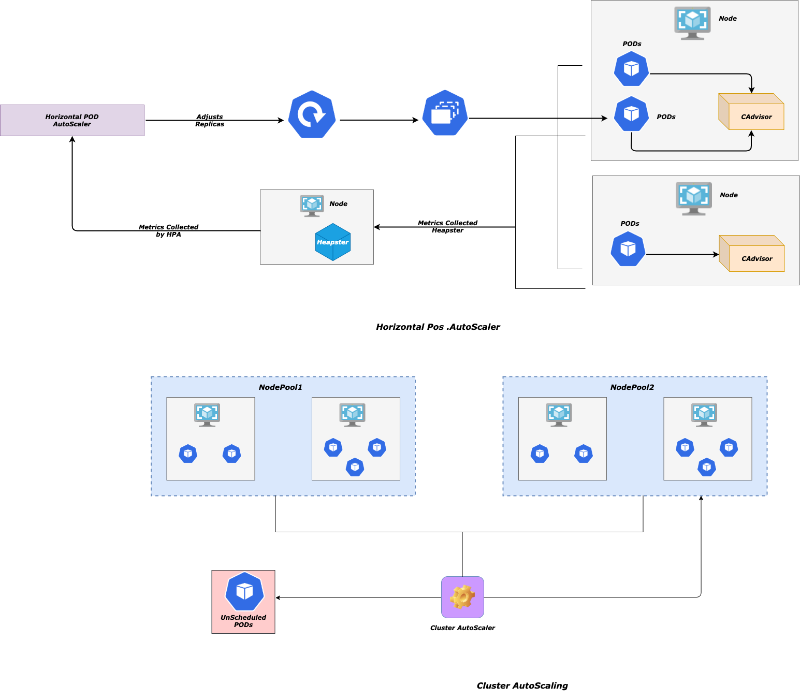

# Automating Kubernetes on Azure - AKS and DevOps

### Prelude

*Azure Kubernetes Service* a.k.a AKS - is a fully managed service that helps to deploy a managed Kubernetes cluster on Azure.

The post management of cluster - Upgrade, Patching, Monitoring - all come as a package. The other important feature is the management of the *Master* Nodes of the cluster - this is completely a *black box* for the user and is entirely maintained by Azure. Users are left with managing only the *Worker* Nodes and associated components.

But AKS cluster is not the only thing that user(s) are going to create; rather the ancillary services around the cluster helping build the entire architecture is most important, painfully redundant and difficult to manage in long terms - more so when you think of the Operations team or Infrastructure management team - who might need to do this for multiple cluster to be managed and many applications to be deployed!

Hence a disciplined, streamlined and automated approach is needed so that end to end architecture becomes robust, resilient and   easily manageable.

The purpose of this workshop would be to:

- Refer the famous AKS workshop - https://docs.microsoft.com/en-us/learn/modules/aks-workshop/ as base and build on top of it
- Use Kubernetes as the tool or orchestration of micro-services
- Build micro-services of varying nature and tech-stack - NodeJS, 
- Build an automated pipeline and workflow for creating Infrastructure for the deploying micro-services - *3-Step Approach*
- Extend the pipeline to automate deployment of micro-services
- Leverage AKS as a hosted service around Kubernetes (a.k.a K8s) for better manageability, less complexity
- Use the built-in features of AKS for monitoring, security and upgrades
- Define Resource Quota and appropriate Storage for micro-services
- Define Network Policies for controlling the communication between different tiers of micro-services
- Integrating with Azure AD and define RBAC for the cluster and its sub-components
- Auto Scale microservices horizontally based on CPU utilisation
- Auto Scale Nodes horizontally
- Secure cluster as well as various ancillary resources using Private Endpoint

###### Pre-requisites, Assumptions

- A basic knowledge on Containers and MicroServices - *L100*
- How to build docker image and create containers from it
- Basic knowledge on K8s (AKS is not mandatory) - *L100*
- Some knowledge on Azure tools & services viz. *Azure CLI, KeyVault, VNET* etc. would help
- Apps and Micro-Services would be used interchangeably i.e. both are treated as same in this context

With this much ammunition, let us get into some action

### Plan

- Review the reference architecture depicting all components

- Understand the 3-step approach for creation of the infrastructure

- Use the 3-step approach locally and create a cluster; deploy and test some micro-services

- Discuss on how to do this through *Azure DevOps*; understand ADO pipelines structure and its usage and then implement the same

  

## AKS Reference Architecture


Let us list down all the necessary components to be used as we move along:

- **Azure Container Registry - ACR** - Used to store application images which then would be used by the K8s (AKS) cluster to create Containers and deploy micro-services in it
- **Azure KeyVault** - Stores all Keys, Secrets or Certificates needed by the micro-services as well as the automation process while creating the infrastructure. This would be used by the entire automation process as mentioned to make sure that creation, sharing or usage of Secrets are absolutely secured and automated as much as practicable. Few exception that we would be highlighting in due course of time
- **Pods** - 
  - The most important component holding the micro-services(s) primarily; will be highly available for apps that need so
  - Each ***Pod*** contains one or multiple *Containers* - each container defines template that would specify configuration
  - This should not be created directly (although one can do that); instead a ***Deployment*** object (*explained below*) would be  responsible for the creation
  - ***Pods*** are *ephemeral* - that means Pods can be removed from Nodes and recreated again from the template - and this removal is happens for many reasons - *Cluster failure, Scaling down* etc. and is managed by K8s orchestration process
  - ***Pods*** are assigned IP addresses by K8s based on the Network plugin you choose - the IP addresses can be either real IPs or virtual ones.The assignment happens after Pods are scheduled by K8s system and before being started; the IPs are not known to the external clients and hence they have to resort to another K8s object called ***Service*** (*explained later*) to reach to the ***Pods***
  - ***Pods*** would be auto scaled *horizontally* when the load increases
  - ***Pod*** comes to a *Pending* state if the K8s Scheduler does not find a suitable ***Node*** for the ***Pod***; these would be scheduled automatically when new ***Nodes*** come up
- **Deployments** -
  - The management plane for ***Pods*** and is responsible for *rolling updates*, *rollbacks* etc.
  - Defines *ReplicaSets* which would define the no. of replicas and their configs
  - *ReplicaSets* are not be created directly (*although one can do that*), just like ***Pods*** and would be handled by ***Deployment*** object
- **Services** - 
  - The premium object for networking within the cluster and communication between ***Pods*** (*i.e. apps or micro-services*)
  - As Pods are ephemeral, their IPs can change when they are deleted and re-created; hence ***Service*** has to provide a unique IP so that external clients can reach to the correct ***Pod***
  - This is how outside world reaches to the ***Pod***  and makes it *workable*
  - A ***Deployment*** object exposes the Pods through a Service so that those (pods) can be reached at and apps can perform
  - ***Service*** can be defined as ***LoadBalancer*** - in which case it exposes a Public IP address for the callers to call this service publicly; service then reaches to the corresponding ***Pod*** (app) and load balances between multiple **Pod** replicas
  - ***Service*** can be defined as ***NodePort*** - in which case every Node in the cluster will open up a port for the Pod and external client can connect to a Node on the designated port and then reach to the Pod - so it is basically more restrained than LoadBalancer option
  - Default type for a ***Service*** is ***ClusterIP*** - This means the Pods behind the Service can be reached only from within the cluster - other process, programs, jobs etc. This is the most secured options and more restrained than other two!
- **Ingress** - 
  - As the name suggests it is the gateway to the cluster...allowing entry to it for the external client(s)
  - Did not we say Service object as ***LoadBalancer*** type also does the same thing? That is true...but imagine multiple services each having a load balancer is another problem to solve - manageability. Whereas, Ingress, juts like a gateway, is a load balancer and proves one unique IP to the external world
  - Behind ***Ingress*** are a series of ***Service*** objects that it can route to...hence it works as a *Router* for all services - which can be a *ClusterIP* or *NodePort* - making these as completely secured, cut-off from outside and only leaving Ingress as the single entry point
  - ***Ingress*** provides many other features like handling *Authentication, SSL termination, Session affinity* (*Cookie-based)*
  - ***Ingress*** also needs an *Ingress Controller* object which manages multiple ***Ingress*** instances for high availability - the implementation is kept open in K8s and  depends on the cloud provider. On AKS we have multiple options - *Nginx, HA*Proxy etc. can be installed as ingress controller Or Azure Application gateway can be used as so. In this exercise, we would go with ***Nginx*** as the controller
- **APIM** - 
  - Azure API management - first class service from Azure for managing APIs, handling Authentication, applying a huge set of policies to APIs
  - All done outside the API landscape and without touching or requiring any change to API code
  - This can be placed in public/private virtual network yielding a public/private IP and accordingly controlling its access
  - We would NOT use APIM here though and it would be part fo a separate article where we would show how APIM can fit into this architecture
- **Application Gateway**  - 
  - Another first class service from Azure as Layer7 load balancer as a PaaS. Since L7, it can route to Http paths of the backend API
  - A pool of backend API routes can be managed through gateway
  - In this exercise, *Application Gateway* would redirect to the *Nginx Ingress Controller,* which would be configured as an **Internal LoadBalancer*, resulting in a *<u>Private IP</u>*. So all calls from outside is blocked and only *Application Gateway* would be the single route to reach to Ingress and hence to the cluster
  - A closer examination of the reference architecture diagram would explain this; things would be more clearer as we move along
- **Azure Monitor** -
  - Azure default monitoring for containers would be used
  - Future plan would be to use Azure monitor for *Prometheus*
- **Azure DevOps** - 
  - The first class product from Azure for all DevOps needs
  - As mentioned earlier, entire infrastructure creation, maintenance and repeated deployments of APIs all would be done through DevOps - so we DO NOT say 100% automation, which is not feasible; rather it is better to say - Maximum Automation

- *CosmosDB/SQL DB* - Only used for the sake of completeness of the apps or micro-services and make it more realistic...no major contribution to the entire workflow

- **Items not listed here** -

  - As is evident from the diagram, there are many other components shown which are not needed for the current exercise
  - These could very much be useful for any such architectures - rather every real life example would have mentions for these
  - ***Logic App*** - for enterprise integrations
  - ***Azure SignalR*** - for real time chat apps
  - and so on and so forth...

  

### Action

Let us now get into some action with all *Plans* in-place!

As we had mentioned, it would be a 3-step approach to create the cluster. We would first do this with scripts from command line and then would do the same using Azure DevOps. Once the cluster is ready, we can start deploying applications onto it. Let us set the ball rolling...

#### Step 1 - PreConfig


This is the Pre-Provisioning of the cluster where the corresponding script would create all necessary resources for the AKS cluster as depicted in the diagram. Primary responsibilities would be:

- Create 2 Service Principals - One for Network roles and another one for ACR; new pull explain that in details shortly

- Create a Virtual Network which would AKS cluster as well as other ancillary components. Now the most important question - what would be address space for VNET and also its subsequent Subnets?

  This is a decision to be taken by Infra team. Assuming that we are going with Azure CNI networking plugin (to be discussed later), all IPs are real ones; no virtual IPs; the Point of considerations for deciding the AKS subnet address space would be  -

  - How many micro-services approximately to be deployed (*now* and *in future*)
  - What would the minimum and maximum no. of replicas for each
  - How much *CPU* and *Memory* that each micro-services could consume approximately
  -  And based on all these -
    - What is Size of each *Node* (VM) i.e how many *Cores of CPU* and how much *GB of Runtime Memory*
    - how many *Nodes* (VMs) that the cluster could expect (*initially and when scaled up?*) - basically *minimum* and *maximum* no. of such *Nodes*
  - Finally *maximum* number of pods or app replicas you want in each *Node* - Ideally whatever be the size of the *Node*, this value should not go beyond 40-50; not an hard and fast rule but with standard VM sizes like 8 Core 16 GB, 40-50 *Pods* per *Node* is good enough

  Based on all these info, let us try to define a formulae to decide what would be the address space of VNET and Subnet for AKS.

  Let us assume,

  Np = Max. Number of Pods in each Node (Ideally should not be more ethan 40-50)

  Nd = Max. Number of Nodes possible (approx.)

  Then the total no. of addresses that you would need in AKS Subnet = *(Np * (Nd + 1) + Np)*

  +1 for reserved IP by system for each Node

  +Np for additional IPs you might need while Upgrade - normally K8s system will pull down one Node at a time, transfer all workloads to another Node and then upgrade the previous Node

  It is advisable to keep some more in buffer based on workloads and other unforeseen situations

  What we have seen, for high end workloads, ideally for a *DEV-UAT* cluster, we should go with /21 or /22 which means around 2k or 1k *Nodes*.

  *PROD* cluster should have a bit more like /18 or /20 which means around 16k or 4k *Nodes*.

  *These are all based on experiences form various projects and values to be decided by Infra team as per their convenience and infrastructure constraints!*

  Once AKS subnet is decided, think how many other Subnets you might need - ideally one for Application Gateway, One for APIM (*if present*) etc.

  Based on that, decide a VNET address space of an address space e.g. xxx.0.0.0/16; this accounts for 65k Ip address approximately - This is also Infra team's discretion

  So, let us create -

  - One VNET for AKS + other resources - /16
  - One Subnet for AKS cluster - /22, /20
  - One Subnet for Application gateway - /27
  - One Subnet for APIM - /29

- Network role assignment - Once VNET/Subnets are created, the service principal for *Network* should be assigned a *Network Contributor* role scoped to the above VNET

- Create ACR - Azure Container Registry for holding container images in a private docker registry provided by Azure as service

- ACR role assignment - Once ACR is created, the service principal for *ACR* should be assigned a *ACRPush* role scoped to the above ACR

- Create KeyVault - KeyVault instance on Azure for holding various secrets - basically the entire automation of AKS and its success would depend on the proper management of this

Let us see how the script is designed to achieve this -

##### aksauto-cluster-preconfig.ps1

```powershell
param([Parameter(Mandatory=$false)] [string] $resourceGroup = "aks-workshop-rg",        
        [Parameter(Mandatory=$false)] [string] $projectName = "aks-workshop",
        [Parameter(Mandatory=$false)] [string] $location = "eastus",
        [Parameter(Mandatory=$false)] [string] $clusterName = "aks-workshop-cluster",
        [Parameter(Mandatory=$false)] [string] $acrName = "akswkshpacr",
        [Parameter(Mandatory=$false)] [string] $keyVaultName = "aks-workshop-kv",
        [Parameter(Mandatory=$false)] [string] $aksVNetName = "aks-workshop-vnet",
        [Parameter(Mandatory=$false)] [string] $aksVNetPrefix = "173.0.0.0/16",        
        [Parameter(Mandatory=$false)] [string] $aksSubnetName = "aks-workshop-subnet",
        [Parameter(Mandatory=$false)] [string] $aksSubNetPrefix = "173.0.0.0/22",
        [Parameter(Mandatory=$false)] [string] $appgwSubnetName = "aks-workshop-appgw-subnet",
        [Parameter(Mandatory=$false)] [string] $appgwSubnetPrefix = "173.0.4.0/27",
        [Parameter(Mandatory=$false)] [string] $vrnSubnetName = "vrn-workshop-subnet",
        [Parameter(Mandatory=$false)] [string] $vrnSubnetPrefix = "173.0.5.0/24",
        [Parameter(Mandatory=$false)] [string] $appgwName = "aks-workshop-appgw",
        [Parameter(Mandatory=$false)] [string] $networkTemplateFileName = "aksauto-network-deploy",
        [Parameter(Mandatory=$false)] [string] $acrTemplateFileName = "aksauto-acr-deploy",
        [Parameter(Mandatory=$false)] [string] $kvTemplateFileName = "aksauto-keyvault-deploy",        
        [Parameter(Mandatory=$false)] [string] $subscriptionId = "6bdcc705-8db6-4029-953a-e749070e6db6",
        [Parameter(Mandatory=$false)] [string] $objectId = "890c52c5-d318-4185-a548-e07827190ff6",
        [Parameter(Mandatory=$false)] [string] $baseFolderPath = "/home/devops-vm-ubuntu1804/Deployments/DEV") # on devops machine

$vnetRole = "Network Contributor"
$aksSPIdName = $clusterName + "-sp-id"
$aksSPSecretName = $clusterName + "-sp-secret"
$acrSPIdName = $acrName + "-sp-id"
$acrSPSecretName = $acrName + "-sp-secret"
$certSecretName = $appgwName + "-cert-secret"

$templatesFolderPath = $baseFolderPath + "/Templates"
$certPFXFilePath = $baseFolderPath + "/Certs/aksauto.pfx"

# Assuming Logged In

$networkNames = "-aksVNetName $aksVNetName -aksVNetPrefix $aksVNetPrefix -aksSubnetName $aksSubnetName -aksSubNetPrefix $aksSubNetPrefix -appgwSubnetName $appgwSubnetName -appgwSubnetPrefix $appgwSubnetPrefix -vrnSubnetName $vrnSubnetName -vrnSubnetPrefix $vrnSubnetPrefix"
$networkDeployCommand = "/Network/$networkTemplateFileName.ps1 -rg $resourceGroup -fpath $templatesFolderPath -deployFileName $networkTemplateFileName $networkNames"

$acrDeployCommand = "/ACR/$acrTemplateFileName.ps1 -rg $resourceGroup -fpath $templatesFolderPath -deployFileName $acrTemplateFileName -acrName $acrName"
$keyVaultDeployCommand = "/KeyVault/$kvTemplateFileName.ps1 -rg $resourceGroup -fpath $templatesFolderPath -deployFileName $kvTemplateFileName -keyVaultName $keyVaultName -objectId $objectId"

# PS Select Subscriotion 
Select-AzSubscription -SubscriptionId $subscriptionId

# CLI Select Subscriotion 
$subscriptionCommand = "az account set -s $subscriptionId"
Invoke-Expression -Command $subscriptionCommand

$rgRef = Get-AzResourceGroup -Name $resourceGroup -Location $location
if (!$rgRef)
{

   $rgRef = New-AzResourceGroup -Name $resourceGroup -Location $location
   if (!$rgRef)
   {
        Write-Host "Error creating Resource Group"
        return;
   }

}

$aksSP = New-AzADServicePrincipal -SkipAssignment
if (!$aksSP)
{

    Write-Host "Error creating Service Principal for AKS"
    return;

}

Write-Host $aksSP.DisplayName
Write-Host $aksSP.Id
Write-Host $aksSP.ApplicationId

$acrSP = New-AzADServicePrincipal -SkipAssignment
if (!$acrSP)
{

    Write-Host "Error creating Service Principal for ACR"
    return;

}

Write-Host $acrSP.DisplayName
Write-Host $acrSP.Id
Write-Host $acrSP.ApplicationId

$networkDeployPath = $templatesFolderPath + $networkDeployCommand
Invoke-Expression -Command $networkDeployPath

$acrDeployPath = $templatesFolderPath + $acrDeployCommand
Invoke-Expression -Command $acrDeployPath

$keyVaultDeployPath = $templatesFolderPath + $keyVaultDeployCommand
Invoke-Expression -Command $keyVaultDeployPath

Write-Host $certPFXFilePath
$certBytes = [System.IO.File]::ReadAllBytes($certPFXFilePath)
$certContents = [Convert]::ToBase64String($certBytes)
$certContentsSecure = ConvertTo-SecureString -String $certContents -AsPlainText -Force
Write-Host $certPFXFilePath

$aksSPObjectId = ConvertTo-SecureString -String $aksSP.ApplicationId `
-AsPlainText -Force
Set-AzKeyVaultSecret -VaultName $keyVaultName -Name $aksSPIdName `
-SecretValue $aksSPObjectId

Set-AzKeyVaultSecret -VaultName $keyVaultName -Name $aksSPSecretName `
-SecretValue $aksSP.Secret

$acrSPObjectId = ConvertTo-SecureString -String $acrSP.ApplicationId `
-AsPlainText -Force
Set-AzKeyVaultSecret -VaultName $keyVaultName -Name $acrSPIdName `
-SecretValue $acrSPObjectId

Set-AzKeyVaultSecret -VaultName $keyVaultName -Name $acrSPSecretName `
-SecretValue $acrSP.Secret

Set-AzKeyVaultSecret -VaultName $keyVaultName -Name $certSecretName `
-SecretValue $certContentsSecure

$aksVnet = Get-AzVirtualNetwork -Name $aksVNetName -ResourceGroupName $resourceGroup
if ($aksVnet)
{

    New-AzRoleAssignment -ApplicationId $aksSP.ApplicationId `
    -Scope $aksVnet.Id -RoleDefinitionName $vnetRole

}

$acrInfo = Get-AzContainerRegistry -Name $acrName `
-ResourceGroupName $resourceGroup
if ($acrInfo)
{

    Write-Host $acrInfo.Id
    New-AzRoleAssignment -ApplicationId $acrSP.ApplicationId `
    -Scope $acrInfo.Id -RoleDefinitionName acrpush

}

Write-Host "------Pre-Config------"
```


#### Step 2 - Setup Cluster (Provisioning)


The is step is fairly straight forward -

- Get ACR reference using PowerShell cmdlet, which was created in the *PreConfig* step
- Get KeyVault reference using PowerShell cmdlet, which was created in the *PreConfig* step - primarily to read the Service Principal values with Network Contributor role which should be assigned to the Cluster
- Get Network reference created in previous *PreConfig* step
- Create the Cluster with all the above info
- The same script can be used to *Update* or *Scale* the Cluster

Let us see how the script is designed to achieve this -

```powershell
param([Parameter(Mandatory=$true)]    [string] $mode,
        [Parameter(Mandatory=$false)] [string] $resourceGroup = "aks-workshop-rg",
        [Parameter(Mandatory=$false)] [string] $location = "eastus",
        [Parameter(Mandatory=$false)] [string] $clusterName = "aks-workshop-cluster",
        [Parameter(Mandatory=$false)] [string] $keyVaultName = "aks-workshop-kv",
        [Parameter(Mandatory=$false)] [string] $aksVNetName = "aks-workshop-vnet",
        [Parameter(Mandatory=$false)] [string] $aksSubnetName = "aks-workshop-subnet",        
        [Parameter(Mandatory=$false)] [string] $version = "1.16.8",
        [Parameter(Mandatory=$false)] [string] $addons = "monitoring",
        [Parameter(Mandatory=$false)] [string] $nodeCount = 3,
        [Parameter(Mandatory=$false)] [string] $minNodeCount = $nodeCount,
        [Parameter(Mandatory=$false)] [string] $maxNodeCount = 20,
        [Parameter(Mandatory=$false)] [string] $maxPods = 40,
        [Parameter(Mandatory=$false)] [string] $vmSetType = "VirtualMachineScaleSets",
        [Parameter(Mandatory=$false)] [string] $nodeVMSize = "Standard_DS3_V2",
        [Parameter(Mandatory=$false)] [string] $networkPlugin= "azure",
        [Parameter(Mandatory=$false)] [string] $networkPolicy = "azure",
        [Parameter(Mandatory=$false)] [string] $nodePoolName = "akslnxpool",
        [Parameter(Mandatory=$false)] [string] $winNodeUserName = "azureuser",
        [Parameter(Mandatory=$false)] [string] $winNodePassword = "PassW0rd@123",
        [Parameter(Mandatory=$false)] [string] $apiServerAuthIP = "52.255.147.91",
        [Parameter(Mandatory=$false)] [string] $aadServerAppID = "<aadServerAppID>",
        [Parameter(Mandatory=$false)] [string] $aadServerAppSecret = "<aadServerAppSecret>",
        [Parameter(Mandatory=$false)] [string] $aadClientAppID = "<aadClientAppID>",
        [Parameter(Mandatory=$false)] [string] $aadTenantID = "<aadTenantID>")


$aksSPIdName = $clusterName + "-sp-id"
$aksSPSecretName = $clusterName + "-sp-secret"
$configSuccessCommand =  "length(@)"

$keyVault = Get-AzKeyVault -ResourceGroupName $resourceGroup -VaultName $keyVaultName
if (!$keyVault)
{

    Write-Host "Error fetching KeyVault"
    return;

}

$spAppId = Get-AzKeyVaultSecret -VaultName $keyVaultName -Name $aksSPIdName
if (!$spAppId)
{

    Write-Host "Error fetching Service Principal Id"
    return;

}

$spPassword = Get-AzKeyVaultSecret -VaultName $keyVaultName -Name $aksSPSecretName
if (!$spPassword)
{

    Write-Host "Error fetching Service Principal Password"
    return;

}

$aksVnet = Get-AzVirtualNetwork -Name $aksVNetName `
-ResourceGroupName $resourceGroup
if (!$aksVnet)
{

    Write-Host "Error fetching Vnet"
    return;

}

$aksSubnet = Get-AzVirtualNetworkSubnetConfig -Name $aksSubnetName `
-VirtualNetwork $aksVnet
if (!$aksSubnet)
{

    Write-Host "Error fetching Subnet"
    return;

}

if ($mode -eq "create")
{

    Write-Host "Creating Cluster... $clusterName"

    $result = az aks create --name $clusterName `
    --resource-group $resourceGroup `
    --kubernetes-version $version --location $location `
    --vnet-subnet-id $aksSubnet.Id --enable-addons $addons `
    --node-vm-size $nodeVMSize `
    --node-count $nodeCount --max-pods $maxPods `
    --service-principal $spAppId.SecretValueText `
    --client-secret $spPassword.SecretValueText `
    --network-plugin $networkPlugin --network-policy $networkPolicy `
    --nodepool-name $nodePoolName --vm-set-type $vmSetType `
    --generate-ssh-keys `
    --windows-admin-username $winNodeUserName `
    --windows-admin-password $winNodePassword `
    --aad-client-app-id $aadClientAppID `
    --aad-server-app-id $aadServerAppID `
    --aad-server-app-secret $aadServerAppSecret `
    --aad-tenant-id $aadTenantID `
    --query $configSuccessCommand

    # --api-server-authorized-ip-ranges $apiServerAuthIP `

    Write-Host "Result - $result"

    if ($result -le 0)
    {

        Write-Host "Error Creating AKS Cluster - $clusterName"
        return;
    
    }
    
}
elseif ($mode -eq "update")
{

    Write-Host "Updating Cluster... $clusterName"
    
    $result = az aks nodepool update --cluster-name $clusterName `
    --resource-group $resourceGroup --enable-cluster-autoscaler `
    --min-count $minNodeCount --max-count $maxNodeCount `
    --name $nodePoolName --query $configSuccessCommand

    Write-Host "Result - $result"

    if ($result -le 0)
    {

        Write-Host "Error Updating AKS Cluster - $clusterName"
        return;
    
    }
    
}
elseif ($mode -eq "scale")
{

    Write-Host "Scaling Cluster... $clusterName"

    $result = az aks nodepool scale --cluster-name $clusterName `
    --resource-group $resourceGroup `
    --node-count $nodeCount --name $nodePoolName `
    --query $configSuccessCommand

    Write-Host "Result - $result"

    if ($result -le 0)
    {

        Write-Host "Error Scaling AKS Cluster - $clusterName"
        return;
    
    }
    
}

Write-Host "-----------Setup------------"


```


## Automate Deployment


## Components and User Roles




## Role Bindings




## Storage - Persistent Volumes & Volume Claims


## Network Policy


## Auto Scaling

