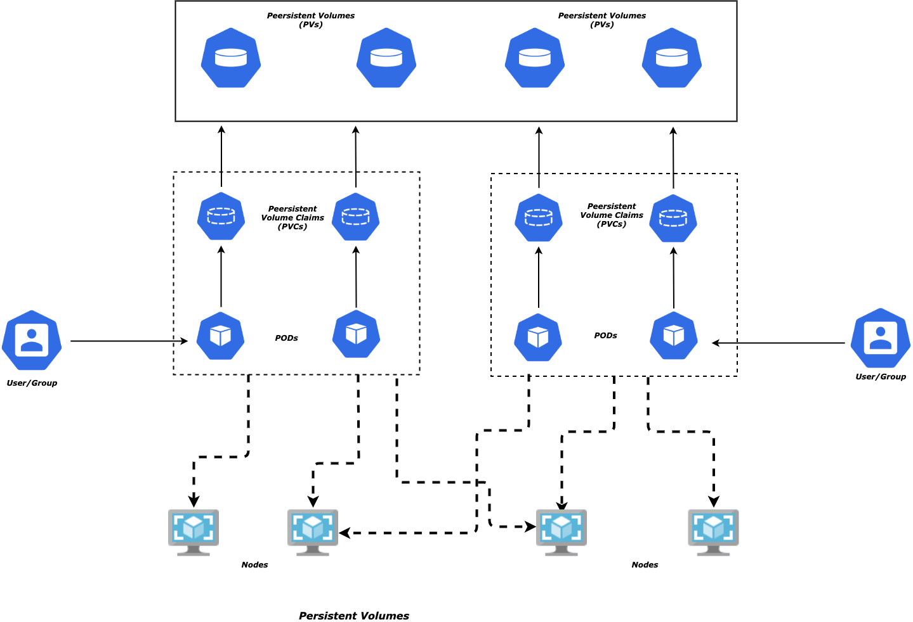
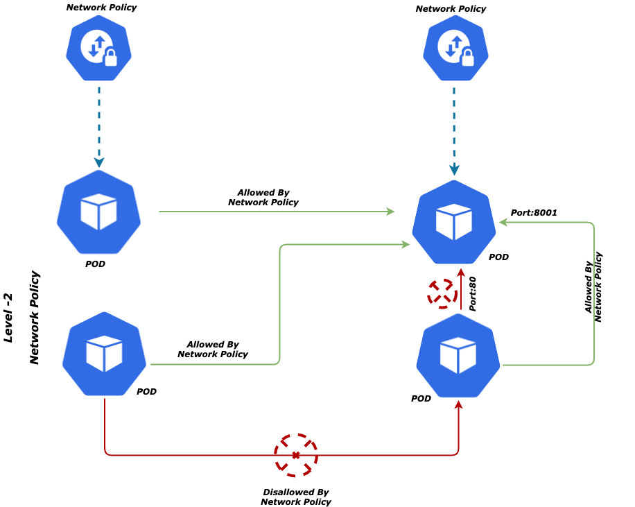

# Automating Kubernetes on Azure - AKS and DevOps

#### Prelude

*Azure Kubernetes Service* a.k.a AKS - is a fully managed service that helps to deploy a managed Kubernetes cluster on Azure.

The post management of cluster - Upgrade, Patching, Monitoring - all come as a package. The other important feature is the management of the *Master* Nodes of the cluster - this is completely a *black box* for the user and is entirely maintained by Azure. Users are left with managing only the *Worker* Nodes and associated components.

But AKS cluster is not the only thing that user(s) are going to create; rather the ancillary services around the cluster helping build the entire architecture is most important, painfully redundant and difficult to manage in long terms - more so when you think of the Operations team or Infrastructure management team - who might need to do this for multiple cluster to be managed and many applications to be deployed!

Hence a disciplined, streamlined and automated approach is needed so that end to end architecture becomes robust, resilient and   easily manageable.

The purpose of this workshop would be to:

- Refer the famous AKS workshop - https://docs.microsoft.com/en-us/learn/modules/aks-workshop/ as base and build on top of it
- Use Kubernetes as the tool or orchestration of micro-services
- Build micro-services of varying nature and tech-stack - NodeJS, 
- Build an automated pipeline and workflow for creating Infrastructure for the deploying micro-services - *3-Step Approach*
- Extend the pipeline to automate deployment of micro-services
- Leverage AKS as a hosted service around Kubernetes (a.k.a K8s) for better manageability, less complexity
- Use the built-in features of AKS for monitoring, security and upgrades
- Define Resource Quota and appropriate Storage for micro-services
- Define Network Policies for controlling the communication between different tiers of micro-services
- Integrating with Azure AD and define RBAC for the cluster and its sub-components
- Auto Scale microservices horizontally based on CPU utilisation
- Auto Scale Nodes horizontally
- Secure cluster as well as various ancillary resources using Private Endpoint

###### Pre-requisites, Assumptions

- A basic knowledge on Containers and MicroServices - *L100*
- How to build docker image and create containers from it
- Basic knowledge on K8s (AKS is not mandatory) - *L100*
- Some knowledge on Azure tools & services viz. *Azure CLI, KeyVault, VNET* etc. would help
- Apps and Micro-Services would be used interchangeably i.e. both are treated as same in this context

With this much ammunition, let us get into some action

#### Plan

- Review the reference architecture depicting all components

- Understand the 3-step approach for creation of the infrastructure

- Use the 3-step approach locally and create a cluster; deploy and test some micro-services

- Discuss on how to do this through Azure DevOps; understand ADO pipelines structure and its usage and then implement the same

  

## AKS Reference Architecture

Let us list down all the necessary components to be used as we move along:

- ***Azure Container Registry - ACR*** - Used to store application images which then would be used by the K8s (AKS) cluster to create Containers and deploy micro-services in it
- ***Azure KeyVault*** - Stores all Keys, Secrets or Certificates needed by the micro-services as well as the automation process while creating the infrastructure. This would be used by the entire automation process as mentioned to make sure that creation, sharing or usage of Secrets are absolutely secured and automated as much as practicable. Few exception that we would be highlighting in due course of time
- ***Pods** - 
  - The most important component holding the micro-services(s) primarily; will be highly available for apps that need so
  - Each ***Pod*** contains one or multiple *Containers* - each container defines template that would specify configuration
  - This should not be created directly (although one can do that); instead a ***Deployment*** object (*explained below*) would be  responsible for the creation
  - ***Pods*** are *ephemeral* - that means Pods can be removed from Nodes and recreated again from the template - and this removal is happens for many reasons - *Cluster failure, Scaling down* etc. and is managed by K8s orchestration process
  - ***Pods*** are assigned IP addresses by K8s based on the Network plugin you choose - the IP addresses can be either real IPs or virtual ones.The assignment happens after Pods are scheduled by K8s system and before being started; the IPs are not known to the external clients and hence they have to resort to another K8s object called ***Service*** (*explained later*) to reach to the ***Pods***
  - ***Pods*** would be auto scaled *horizontally* when the load increases
  - ***Pod*** comes to a *Pending* state if the K8s Scheduler does not find a suitable ***Node*** for the ***Pod***; these would be scheduled automatically when new ***Nodes*** come up
- ***Deployments*** -
  - The management plane for ***Pods*** and is responsible for *rolling updates*, *rollbacks* etc.
  - Defines *ReplicaSets* which would define the no. of replicas and their configs
  - *ReplicaSets* are not be created directly (*although one can do that*), just like ***Pods*** and would be handled by ***Deployment*** object
- ***Services*** - 
  - The premium object for networking within the cluster and communication between ***Pods*** (*i.e. apps or micro-services*)
  - As Pods are ephemeral, their IPs can change when they are deleted and re-created; hence ***Service*** has to provide a unique IP so that external clients can reach to the correct ***Pod***
  - This is how outside world reaches to the ***Pod***  and makes it *workable*
  - A ***Deployment*** object exposes the Pods through a Service so that those (pods) can be reached at and apps can perform
  - ***Service*** can be defined as ***LoadBalancer*** - in which case it exposes a Public IP address for the callers to call this service publicly; service then reaches to the corresponding ***Pod*** (app) and load balances between multiple **Pod** replicas
  - ***Service*** can be defined as ***NodePort*** - in which case every Node in the cluster will open up a port for the Pod and external client can connect to a Node on the designated port and then reach to the Pod - so it is basically more restrained than LoadBalancer option
  - Default type for a ***Service*** is ***ClusterIP*** - This means the Pods behind the Service can be reached only from within the cluster - other process, programs, jobs etc. This is the most secured options and more restrained than other two!
- ***Ingress*** - 
  - As the name suggests it is the gateway to the cluster...allowing entry to it for the external client(s)
  - Did not we say Service object as ***LoadBalancer*** type also does the same thing? That is true...but imagine multiple services each having a load balancer is another problem to solve - manageability. Whereas, Ingress, juts like a gateway, is a load balancer and proves one unique IP to the external world
  - Behind ***Ingress*** are a series of ***Service*** objects that it can route to...hence it works as a *Router* for all services - which can be a *ClusterIP* or *NodePort* - making these as completely secured, cut-off from outside and only leaving Ingress as the single entry point
  - ***Ingress*** provides many other features like handling *Authentication, SSL termination, Session affinity* (*Cookie-based)*
  - ***Ingress*** also needs an *Ingress Controller* object which manages multiple ***Ingress*** instances for high availability - the implementation is kept open in K8s and  depends on the cloud provider. On AKS we have multiple options - *Nginx, HA*Proxy etc. can be installed as ingress controller Or Azure Application gateway can be used as so. In this exercise, we would go with ***Nginx*** as the controller
- ***APIM*** - 
  - Azure API management - first class service from Azure for managing APIs, handling Authentication, applying a huge set of policies to APIs
  - All done outside the API landscape and without touching or requiring any change to API code
  - This can be placed in public/private virtual network yielding a public/private IP and accordingly controlling its access
  - We would NOT use APIM here though and it would be part fo a separate article where we would show how APIM can fit into this architecture
- ***Application Gateway***  - 
  - Another first class service from Azure as Layer7 load balancer as a PaaS. Since L7, it can route to Http paths of the backend API
  - A pool of backend API routes can be managed through gateway
  - In this exercise, *Application Gateway* would redirect to the Nginx Ingress Controller

- CosmosDB/SQL DB* - Only used for the sake of completeness of the apps or micro-services and make it more realistic...no major contribution to the entire workflow

  

## Automate Deployment

## Components and User Roles

## Role Bindings

## Storage - Persistent Volumes & Volume Claims

## Network Policy

## Auto Scaling

